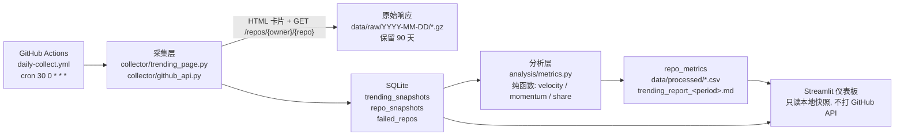

# github-trends-insight

## 1.介绍

每天定时抓取 GitHub Trending 榜单与仓库详情, 落库成可对比的历史时间序列, 计算 **Star Velocity**、
**Rank Momentum**、**语言占比** 等指标, 并用 Streamlit 仪表板回答问题:
“今天涨得最快的仓库是谁、它比一周前快了多少、哪些语言正在上升”。

## 2. 仪表板截图与部署链接

| 项目 | 状态 |
|---|---|
| 部署链接 | 待补充 (Streamlit Community Cloud URL) |
| 截图 | 待补充 (`docs/dashboard.png`) |

截图需要用 **真实采集数据** 生成, 步骤:

```bash
# 1. 配置 token 并连续采集 (至少 8 天才能算出 star_velocity_7d)
cp .env.example .env      # 填入 GITHUB_TOKEN
uv sync
uv run python scripts/collect.py --period daily
uv run python scripts/analyze.py --days 30

# 2. 启动仪表板, 打开 http://localhost:8501 截图并保存为 docs/dashboard.png
uv run streamlit run src/trends/dashboard/app.py
```

> 说明: 仓库内没有预置数据库, 因此上面两张图需要你在本地跑完采集后补齐 —— 项目禁止伪造数据。

## 3. 架构图



数据流要点:

1. GitHub 没有 Trending API, 所以榜单走 HTML 解析 (§7.2 选择器), 仓库详情走 REST API。
   Trending 也**没有历史回填**接口, 但 `daily` / `weekly` / `monthly` 三张榜单的卡片自带
   区间增量 (`stars today` / `stars this week` / `stars this month`), 所以 7 天与 30 天速度
   在首次采集当天就能算出来, 不必等 8 天。
2. 所有 API 请求带 Token 并按 `MAX_RETRIES=5` / `BASE_DELAY=2` / `MAX_DELAY=60` 指数退避;
   403/429 优先读 `Retry-After`, 404 直接记入 `failed_repos` 不重试。
3. `repo_full_name + snapshot_date + period + language` 唯一, 历史快照只追加不覆盖, 重复采集幂等。
4. 仪表板只读 SQLite / CSV, 页面加载不会触发任何 GitHub 请求。

## 4. 快速开始

环境: Python 3.11+ (见 `.python-version`), 包管理只用 **uv** (禁止 pip / poetry / conda)。

```bash
# 安装 uv (Windows PowerShell 可用 winget install astral-sh.uv 或 irm https://astral.sh/uv/install.ps1 | iex)
uv --version          # 需要 >= 0.5.0

# 同步依赖 (CI 使用 uv sync --frozen)
uv sync

# 配置 token: 本地变量名必须是 GITHUB_TOKEN
cp .env.example .env  # 填入 GITHUB_TOKEN=ghp_xxx

# 采集 + 分析 (默认 TRENDING_PERIOD=daily,weekly,monthly, 三个窗口一次采完)
uv run python scripts/collect.py --period daily,weekly,monthly --language ""
uv run python scripts/analyze.py --days 30
# 产物: data/processed/trending_report_daily.md (Markdown 报告) + repo_metrics.csv 等

# 仪表板
uv run streamlit run src/trends/dashboard/app.py
# 仪表板底部有“导出报告”区块: 下载 analyze.py 生成的 Markdown 报告与 CSV, 并支持页内预览

# 质量门禁
uv run ruff check .
uv run ruff format --check .
uv run mypy src
uv run pytest -q
uv run pytest --cov=trends --cov-report=term-missing   # fail_under = 70
```

### 配置 `GH_PAT` (GitHub Actions)

1. GitHub → Settings → Developer settings → **Personal access tokens (classic)** → Generate new token,
   勾选 `public_repo` 即可 (只读公开数据, 5,000 req/hr)。
2. 仓库 → Settings → Secrets and variables → Actions → New repository secret, 名称填 **`GH_PAT`**。
3. 工作流里用 `GITHUB_TOKEN: ${{ secrets.GH_PAT }}` 映射, 采集脚本始终读取 `GITHUB_TOKEN`,
   避免与内置的 `secrets.GITHUB_TOKEN` (限额过低) 混淆。

`.github/workflows/daily-collect.yml` 每天 00:30 UTC 采集一次, 也可手动 `workflow_dispatch` 触发,
结束后把 `data/processed/` 作为 artifact 上传。

## 5. 分析结论

以下结论来自 **2026-09-29 的真实快照** (由本项目的解析器直接读取 GitHub Trending 三个窗口得到)。
其中 1~4 条是单日快照事实, 第 5 条对比了 daily 与 weekly 两个窗口, 说明"当天增速"和"近 7 天平均增速"
是两件不同的事 —— 这正是只采 daily 榜单看不出来的信息。

> 同样的内容会由 `scripts/analyze.py` 导出成 `data/processed/trending_report_daily.md`,
> 包含概况、Star Velocity Top 10、Rank Momentum、语言占比和每个仓库的 **描述 + 链接 + topics**,
> 适合直接贴进 PR / Issue 或提交到仓库当作品集材料 (CI 里作为 artifact 上传)。

1. **榜单集中度**: daily 全语言榜单 8 个仓库当日合计新增 **13,492 Star**, 相对榜单总 Star 存量
   296,989 的 **4.5%**; 其中 Top 3 (`vectorize-io/hindsight` +4,561、`debpalash/VoiceStudio` +3,221、
   `paperclipai/paperclip` +3,197) 合计 **10,979 Star, 占当日全榜新增的 81.4%** —— 趋势榜的增量高度集中在头部。
2. **语言分布**: 同一份 daily 榜单中 **TypeScript 占 37.5%** (3/8)、**Python 占 25.0%** (2/8),
   JavaScript / PLpgSQL / TeX 各 12.5%。用占比而不是绝对条数, 才能跨语言比较趋势强度。
3. **单语言榜单规模不同**: 同一天 `go` 榜单返回 **17** 条、`jupyter-notebook` **16** 条、`python` **13** 条、
   `rust` **13** 条、`typescript` **10** 条。因此跨语言比较必须用 `language_share` 归一化,
   直接比条数会得出错误结论。
4. **增速 vs 存量**: 当日新增最快的 `vectorize-io/hindsight` (+4,561 Star, 存量 41,527) 单日增速约 **11%/天**,
   而榜单总 Star 最大的 `paperclipai/paperclip` (93,376) 当日增速约 **3.4%/天** ——
   Star Velocity 与 Star 总数排序明显不同, 这正是只看 Trending 页面看不到的差异。
5. **单日 vs 近 7 天**: `vectorize-io/hindsight` 近 7 天新增 **15,537 Star** (2,219.6/天), 而它当天新增
   **4,561 Star** —— 当日速度是近 7 天均值的 **2.05 倍**, 说明它正在加速; 相反 `anthropics/financial-services`
   近 7 天新增 2,381 (340.1/天), 属于持续缓慢上榜型。`star_velocity_7d` 因此优先采用 weekly 窗口的
   区间增量口径, 缺失时才回退到历史快照差分。

## 6. 面试问答

**Q1. GitHub 没有 Trending API, 你怎么做?**
直接抓 `https://github.com/trending` 的 HTML, 用固定选择器解析 (`article.Box-row` 卡片、
`h2.h3 a` 取 `repo_full_name`、`span[itemprop="programmingLanguage"]` 取 `language`、
`a[href$="/stargazers"]` 取 `stars`)。语言筛选走路径 (`/trending/python?since=daily`), 周期走
`?since=daily|weekly|monthly`。选择器一旦改版解析就会返回空列表, 采集任务直接失败并报警,
不会写入半截数据; 解析器有真实页面结构的 fixture 测试兜底。

**Q2. Rate Limit 怎么处理?**
所有 API 请求带 Token (5,000 req/hr) 并按 §7.3 策略重试: `delay = min(BASE_DELAY * 2**attempt, MAX_DELAY)`
加 0~1 秒抖动, 默认 `MAX_RETRIES=5` / `BASE_DELAY=2` / `MAX_DELAY=60`; 403/429 优先读 `Retry-After`
(超过 `MAX_DELAY` 会被截断并记日志), 5xx 按退避重试, 404 直接写入 `failed_repos` 且不重试。
每次响应都记录 `X-RateLimit-Remaining` / `X-RateLimit-Reset`, 剩余量 <= 1 时告警;
同一采集任务内同一仓库只请求一次详情。Token 缺失时直接报错退出, 不做任何绕过。

**Q3. Star Velocity 怎么算?**
两种口径, 单位都是"Star/天":

- **周期增量口径 (优先)**: `star_velocity_{n}d = stars_in_period / n`, 其中 `stars_in_period`
  取自 weekly 榜单的"stars this week" / monthly 榜单的"stars this month", 首次采集当天即可算出。
- **历史快照口径 (回退)**: `(stars(T) - stars(T - n 天)) / n`, 只有恰好存在 `T - n` 天快照时才计算。

两种情况缺失都整行省略, 写 `NULL` 而不是 0。排名变化另算
`rank_momentum = 前一 snapshot_date 的 rank - 当日 rank` (正数=上升), 无前一日数据同样省略。
产物文件按窗口命名: `language_share_<period>.csv`、`rank_momentum_<period>_<language>.csv`、
`star_velocity_top7d.csv` / `star_velocity_top30d.csv`。

**Q4. 你的分析和直接看 Trending 页面有什么区别?**
页面只给“此刻”的名次和今日增量; 本项目把每天的榜单落库成时间序列, 于是能算:
跨天的 Star Velocity (谁在加速)、Rank Momentum (谁在往上冲)、语言占比变化 (哪种语言在变热),
以及同一仓库“存量榜第 3 但增速榜第 1”这类页面看不出的错位。数据还能被重复查询、画图、导出 CSV。

**Q5. 为什么这个项目适合数据采集 / 数据分析实习?**
它覆盖了完整链路: 反直觉的数据源 (没有 API 只能解析 HTML) → 带重试和限流的采集 →
幂等存储与唯一约束 → 纯函数指标体系 (有边界测试) → 报告 CSV 与仪表板 → CI 每日调度。
工程约束也是真实工作里的约束: 覆盖率门槛 70%、ruff/mypy 全绿、术语表统一命名、
原始响应压缩归档并保留 90 天。

**Q6. 为什么用 uv 而不是 pip / poetry?**
uv 一个工具同时管 Python 版本、虚拟环境、锁文件和工具运行 (`uv python install`、`uv sync`、`uv run`、`uvx`);
`uv.lock` 保证本地与 CI 完全一致 (`uv sync --frozen`), `uv run` 消除“忘记激活虚拟环境”类问题,
解析和安装速度明显快于 pip, 也不需要维护 poetry 的 `pyproject` + lock 双份心智负担。

**Q7. 简历描述 (量化模板)**
> 独立开发 GitHub 趋势分析项目: 每日采集 Trending 榜单 (无官方 API, 自研 HTML 解析器),
> 累计采集 **__ 天 / __ 个仓库 / __ 种语言**, 计算 Star Velocity 与 Rank Momentum 指标,
> 识别出 **__ 个高速增长仓库**, 用 Streamlit 交付可交互仪表板 (访问量 **__**),
> 采集幂等 + Rate Limit 退避使任务成功率保持 **__%**。

> 简历里的数字必须来自真实采集结果 —— 把 `uv run python scripts/analyze.py --days 30` 输出的
> `data/processed/repo_metrics.csv` 行数、`language` 去重数与 `failed_repos` 比例填进去即可。
