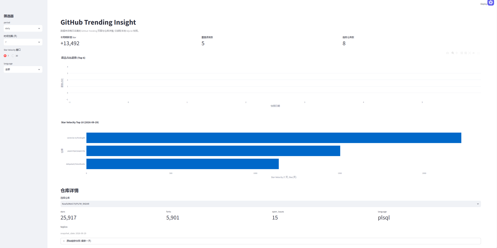
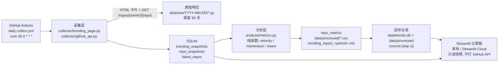

# GitHub Trends Insight

[](https://github.com/husy7/GitHub-TrendsInsight/actions/workflows/daily-collect.yml)


[](LICENSE)

采集 GitHub Trending 榜单与仓库详情，落库成可对比的历史时间序列，计算 **Star Velocity**、**Rank Momentum**、
**语言占比**，并用 Streamlit 仪表板回答：谁在加速、哪种语言在变热。面向 **数据采集 / 数据分析实习** 的作品集项目。

| | |
|---|---|
| 数据源 | GitHub Trending 页面（无官方 API，自研 HTML 解析器）+ GitHub REST API 仓库详情 |
| 采集窗口 | `daily` / `weekly` / `monthly` 三个榜单，首次采集当天即可产出 7 天与 30 天速度 |
| 调度 | GitHub Actions 每天 UTC 00:30 自动采集，快照回写仓库 → Streamlit Cloud 自动重建 |
| 质量 | 186 个测试、覆盖率 97.5%、`ruff` + `mypy --strict` 全绿、覆盖率门槛 70% |



> 截图来自 `2026-09-29` 的真实采集结果；同一份数据的 Markdown 报告见
> [data/processed/trending_report_daily.md](data/processed/trending_report_daily.md)。

## 目录

- [功能特性](#功能特性)
- [架构](#架构)
- [快速开始](#快速开始)
- [使用说明](#使用说明)
- [目录结构](#目录结构)
- [自动化与数据持久化](#自动化与数据持久化)
- [数据与指标口径](#数据与指标口径)
- [分析结论](#分析结论)
- [开发与测试](#开发与测试)
- [文档](#文档)
- [路线图](#路线图)
- [贡献](#贡献)
- [许可证](#许可证)

## 功能特性

- **没有 API 就解析 HTML**：GitHub 不提供 Trending API，项目用 BeautifulSoup 解析榜单卡片
  （`article.Box-row`），语言筛选走 `/trending/python?since=daily` 这样的路径。
- **三个窗口一次采完**：`daily` / `weekly` / `monthly` 同时采集。卡片上的 `stars today` /
  `stars this week` / `stars this month` 是真实区间增量，落库为 `stars_in_period`，因此
  `star_velocity_7d` / `star_velocity_30d` 当天就有值，不必等 8 天。
- **限流合规**：所有 API 请求带 Token，403/429/5xx 指数退避重试（默认 5 次、2 秒起步、上限 60 秒），
  403/429 优先读 `Retry-After`，404 记入 `failed_repos` 不重试，同一仓库一次任务只请求一次。
- **幂等存储**：`repo_full_name + snapshot_date + period + language` 唯一，历史快照只追加不覆盖；
  缺失值写 `NULL`（不补 0）；时间统一 UTC。
- **纯函数指标**：`compute_star_velocity` / `compute_rank_momentum` / `compute_language_share` /
  `compute_period_star_velocity` 无 IO、无副作用，数据不足时整行省略。
- **多种交付物**：`data/processed/` 下的 CSV 与 Markdown 报告，以及只读快照的 Streamlit 仪表板
  （含"导出报告"下载按钮）。
- **每日自动化**：GitHub Actions 采集 + 分析 + 回写仓库，配合 Streamlit Cloud 自动更新站点。

## 架构



数据流要点：

1. Trending 没有历史回填接口，所以"前 7 天 / 前 30 天"用 weekly / monthly 榜单的区间增量代替
   （数学上等价于窗口内的日均速度）。
2. 采集失败即整体失败：任一窗口解析出 0 个仓库就报错退出，不写半截数据。
3. 仪表板只读 SQLite 与 `data/processed/`，页面加载不会触发任何 GitHub 请求。
4. Actions runner 是临时机器，所以工作流把快照回写仓库来持久化时间序列（见下文）。

## 快速开始

### 环境要求

| 依赖 | 版本 | 说明 |
|---|---|---|
| Python | 3.11+ | 以 `.python-version` 为准 |
| [uv](https://docs.astral.sh/uv/) | >= 0.5 | 唯一允许的包管理与环境工具 |
| GitHub Token | — | 本地变量名必须是 `GITHUB_TOKEN`，只用于 REST API 仓库详情 |

### 安装

```bash
git clone git@github.com:husy7/GitHub-TrendsInsight.git
cd GitHub-TrendsInsight

uv --version          # 需要 >= 0.5.0
uv sync               # CI 使用 uv sync --frozen

cp .env.example .env  # 填入 GITHUB_TOKEN=ghp_xxx
```

### 环境变量

| 变量 | 默认值 | 说明 |
|---|---|---|
| `GITHUB_TOKEN` | 空 | 本地必填；Actions 中由 `secrets.GH_PAT` 映射注入 |
| `DATABASE_URL` | `sqlite:///data/trends.db` | SQLAlchemy 连接串 |
| `LOG_LEVEL` | `INFO` | 日志级别（时间戳为 UTC） |
| `TRENDING_PERIOD` | `daily,weekly,monthly` | 采集窗口，支持逗号分隔或 `all` |
| `TRENDING_LANGUAGE` | 空（全部） | 榜单语言筛选值，如 `python` |
| `HTTP_TIMEOUT` | `15` | 单请求超时（秒） |
| `MAX_RETRIES` | `5` | 重试次数 |
| `BASE_DELAY` | `2` | 指数退避基数（秒） |
| `MAX_DELAY` | `60` | 退避与 `Retry-After` 的上限（秒） |

### 采集与分析

```bash
# 采集 daily + weekly + monthly 三个窗口（默认即三窗口）
uv run python scripts/collect.py --period daily,weekly,monthly --language ""

# 计算指标并导出 data/processed/ 产物
uv run python scripts/analyze.py --days 30
```

### 启动仪表板

```bash
uv run streamlit run src/trends/dashboard/app.py
# 打开 http://localhost:8501；页面底部"导出报告"可下载 Markdown 报告与 CSV
```

## 使用说明

### `scripts/collect.py`

| 参数 | 默认 | 说明 |
|---|---|---|
| `--period` | `TRENDING_PERIOD` | `daily,weekly,monthly` 或 `all` |
| `--language` | `TRENDING_LANGUAGE` | 语言筛选值，`""` 表示全部 |
| `--spoken-language-code` | 空 | 口语语言筛选（`spoken_language_code`） |
| `--database-url` | `DATABASE_URL` | 覆盖数据库连接串 |
| `--raw-dir` | `data/raw` | 原始响应归档目录（gzip，保留 90 天） |

### `scripts/analyze.py`

| 参数 | 默认 | 说明 |
|---|---|---|
| `--days` | `30` | 分析回溯天数 |
| `--period` | `TRENDING_PERIOD` | 主榜单窗口，决定 `repo_metrics` 的仓库范围 |
| `--language` | `TRENDING_LANGUAGE` | 语言筛选值 |
| `--database-url` | `DATABASE_URL` | 覆盖数据库连接串 |
| `--output-dir` | `data/processed` | 产物目录 |

### 产物

| 文件 | 内容 |
|---|---|
| `data/processed/trending_report_<period>.md` | Markdown 报告：概览 + Velocity Top 10 + 动量 + 语言占比 + 仓库明细（描述 / 链接 / topics） |
| `data/processed/repo_metrics.csv` | 逐仓库指标（速度 / 动量 / 语言占比） |
| `data/processed/star_velocity_top7d.csv` | 近 7 天速度 Top 10 |
| `data/processed/star_velocity_top30d.csv` | 近 30 天速度 Top 10 |
| `data/processed/language_share_<period>.csv` | 各窗口语言占比 |
| `data/processed/rank_momentum_<period>_<language>.csv` | 各窗口排名动量 |
| `data/trends.db` | SQLite：`trending_snapshots` / `repo_snapshots` / `repo_metrics` / `failed_repos` |
| `data/raw/<snapshot_date>/*.gz` | 原始响应（榜单 HTML + 仓库 JSON），保留 90 天后自动清理，不入库 |

## 目录结构

```text
github-trends-insight/
├── scripts/
│   ├── collect.py              # 采集入口
│   └── analyze.py              # 分析入口（含 Markdown 报告）
├── src/trends/
│   ├── config.py               # Settings / 术语表常量 / period 解析
│   ├── logging_setup.py
│   ├── collector/
│   │   ├── trending_page.py    # HTML 解析 + 抓取重试
│   │   ├── github_api.py       # REST API 客户端（去重 / 失败记录）
│   │   └── rate_limit.py       # 退避与 Rate Limit 追踪
│   ├── storage/
│   │   ├── models.py           # 4 张表的 DDL 与数据类
│   │   ├── db.py               # 幂等写入 / 列迁移 / 读取
│   │   └── raw_store.py        # gzip 归档 + 90 天清理
│   ├── analysis/
│   │   ├── metrics.py          # 纯函数指标
│   │   └── reports.py          # CSV + Markdown 报告
│   └── dashboard/app.py        # Streamlit 单页仪表板
├── tests/                      # 186 个测试（fixtures 全部离线）
├── data/{raw,processed}/
├── docs/interview.md           # 面试问答
├── AGENTS.md                   # 工程规范（命名 / 口径 / 工作流）
└── .github/workflows/daily-collect.yml
```

## 自动化与数据持久化

`.github/workflows/daily-collect.yml` 每天 UTC 00:30（北京时间 08:30）执行，也可在 Actions 页面手动触发：

1. `uv sync --frozen`，然后跑质量门禁（`ruff check` / `ruff format --check` / `mypy src` / `pytest -q`）；
2. 采集 `daily,weekly,monthly` 三个窗口与仓库详情；
3. 计算指标、导出 CSV 与 Markdown 报告；
4. 把 `data/trends.db` 与 `data/processed/` 以 `chore: daily snapshot <date> [skip ci]` 提交回仓库；
5. 同时把 `data/processed/` 作为 artifact 上传，便于单独下载。

因为数据会回写仓库，Streamlit Cloud 只要连接本仓库就能随每次 push 自动重建；`data/raw/` 体积大，不入库。

### 配置 `GH_PAT`

1. GitHub → Settings → Developer settings → **Personal access tokens (classic)** → Generate new token，
   勾选 `public_repo`（只读公开数据，5,000 req/hr）。
2. 仓库 → Settings → Secrets and variables → Actions → New repository secret，名称填 **`GH_PAT`**。
3. 工作流用 `GITHUB_TOKEN: ${{ secrets.GH_PAT }}` 映射；采集脚本始终读取 `GITHUB_TOKEN`，
   避免与内置 `secrets.GITHUB_TOKEN`（限额过低）混淆。

> 排错：如果运行日志里出现 `GITHUB_TOKEN is missing`，或日志 `env:` 段落里 `GITHUB_TOKEN:` 是空值，
> 说明 secret 没被解析到 —— 检查它是否加在 **Secrets**（而不是 Variables）、名称是否精确为 `GH_PAT`、
> 是否加在本仓库上（工作流第一步 `Validate required secret` 会先报这个错）。

> 本地跑 `collect.py` / `analyze.py` 同样会修改受版本控制的 `data/trends.db` 与 `data/processed/`，
> 想同步就 `git commit` 即可。

## 数据与指标口径

| 指标 | 定义 | 缺失处理 |
|---|---|---|
| `stars_in_period` | 榜单卡片的区间增量：daily=今日、weekly=近 7 天、monthly=近 30 天 | `NULL` |
| `star_velocity_7d` | 优先 `stars_in_period(weekly) / 7`；缺失时回退 `(stars(T) - stars(T-7)) / 7` | 整行省略 |
| `star_velocity_30d` | 同上，用 monthly 窗口或 30 天前的快照 | 整行省略 |
| `rank_momentum` | 同 period + language 下 `前一 snapshot_date 的 rank - 当日 rank`（正数=上升） | 整行省略 |
| `language_share` | 当日该语言仓库数 / 当日全部趋势仓库数 | 不写 0 |

其他约定：`snapshot_date` 为 UTC `YYYY-MM-DD`；时间戳为带 `Z` 的 ISO8601；`language` 统一小写
（别名映射见 `src/trends/config.py`）；同一快照键重复采集不会产生重复行。

## 分析结论

以下结论来自 **2026-09-29 的真实快照**（由本项目的解析器直接读取 GitHub Trending 三个窗口得到）。
第 1~4 条是单日快照事实，第 5 条对比 daily 与 weekly 两个窗口；同样的内容会导出为
[data/processed/trending_report_daily.md](data/processed/trending_report_daily.md)。

1. **榜单增量高度集中**：daily 全语言榜单 8 个仓库当日合计新增 **13,492 Star**，占榜单总 Star 存量
   297,960 的 **4.5%**；其中 Top 3（`vectorize-io/hindsight` +4,561、`debpalash/VoiceStudio` +3,221、
   `paperclipai/paperclip` +3,197）合计 **10,979 Star，占当日全榜新增的 81.4%**。
2. **语言分布**：同一份 daily 榜单中 **TypeScript 37.5%**（3/8）、**Python 25.0%**（2/8），
   JavaScript / PLpgSQL / TeX 各 12.5% —— 用占比而不是绝对条数，才能跨语言比较趋势强度。
3. **单语言榜单规模不同**：同一天 `go` 榜单返回 **17** 条、`jupyter-notebook` **16** 条、`python` **13** 条、
   `rust` **13** 条、`typescript` **10** 条，跨语言比较必须先归一化。
4. **增速与存量排序不同**：当日新增最快的 `vectorize-io/hindsight`（+4,561 Star，存量 41,662）单日增速约
   **11%/天**，而存量最大的 `paperclipai/paperclip`（93,558）约 **3.4%/天** —— 只看 Trending 页面看不出这种错位。
5. **单日 vs 近 7 天**：`vectorize-io/hindsight` 近 7 天新增 **15,537 Star**（2,219.6/天），当天新增 4,561，
   当日速度是近 7 天均值的 **2.05 倍**（正在加速）；而 `anthropics/financial-services` 近 7 天
   2,381（340.1/天），属于持续缓慢上榜型。

## 开发与测试

```bash
uv run ruff check .          # lint
uv run ruff format --check . # 格式
uv run mypy src              # 严格类型检查
uv run pytest -q             # 单元 + 端到端测试（HTTP 全部 mock，离线可跑）
uv run pytest --cov=trends --cov-report=term-missing   # 覆盖率门槛 70%
```

- 测试不依赖真实网络、真实 Token 与真实数据库：解析用 `tests/fixtures/` 的 HTML，API 用 `respx` mock，
  数据库用临时 SQLite，仪表板用 `streamlit.testing` 的 `AppTest` 真跑一遍。
- 当前规模：**186 个测试 / 覆盖率 97.5%**；覆盖率低于 70% 时 `pytest` 直接失败。
- 工程约定（命名术语表、数据表 DDL、工作流规则）见 [AGENTS.md](AGENTS.md)。

## 文档

| 文档 | 内容 |
|---|---|
| [docs/interview.md](docs/interview.md) | 面试问答：为什么解析 HTML、Rate Limit 怎么处理、Star Velocity 怎么算、为什么用 uv 等 |
| [data/processed/trending_report_daily.md](data/processed/trending_report_daily.md) | 最新 Markdown 报告（每天由 Actions 更新） |
| [AGENTS.md](AGENTS.md) | 工程规范：术语表、数据表 DDL、指标签名、CI 与提交规则 |

## 路线图

- [ ] 部署到 Streamlit Community Cloud 并在此补上公开访问链接
- [ ] 连续采集 30 天后，把跨天结论（Rank Momentum 榜、语言占比趋势）补进"分析结论"
- [ ] 支持一次采集多个语言榜单（`--languages python,rust,go`）并在 CI 中矩阵化
- [ ] weekly / monthly 各出一份独立报告

## 贡献

欢迎提 Issue 或 PR。提交前请保证 `uv run ruff check .`、`uv run mypy src`、`uv run pytest -q` 全绿；
提交信息使用 [Conventional Commits](https://www.conventionalcommits.org/)（如 `feat: ...` / `fix: ...`），
新增依赖一律通过 `uv add` / `uv add --dev` 并提交 `uv.lock`。

## 许可证

本项目基于 [MIT License](LICENSE) 发布。
